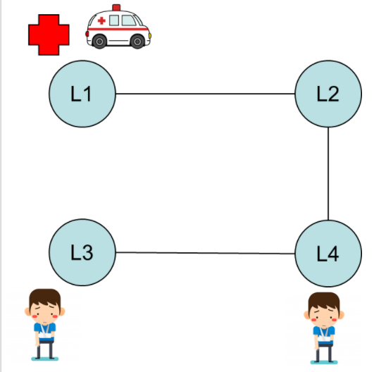

# Planificación en STRIPS/PDDL

## Objetivos de la actividad

- Incentivar el proceso investigativo y utilizar los planificadores del estado de arte para solucionar un problema en STRIPS/PDDL.
- Descripción de la actividad y pautas de elaboración.

## Desarrollo
Soluciona en STRIPS/PDDL el siguiente problema. Expresa el siguiente escenario en PDDL: en una ciudad existen cuatro localizaciones, un hospital, una ambulancia, y dos enfermos. Tal como indica la siguiente figura (situación inicial):

La localización L1 está conectada con L2, L2 está conectada con L4, y L4 está conectada con L3. Todas en ambas direcciones. La ambulancia y el hospital se encuentran en la localización L1. Y hay un paciente en la localización L3 y otro en la localización L4.

El objetivo es trasladar los pacientes al hospital. Las acciones que se pueden realizar son:

- Conducir la ambulancia de una posición a otra.
- Subir un paciente a la ambulancia.
- Bajar a un paciente en una localización.

Se deberá modelar en PDDL (dominio.pddl y problema.pddl) el escenario que se plantea en la situación inicial y resolver el problema con cuatro planificadores del estado del arte. El estudiante debe buscar y configurar por su cuenta los planificadores.

En esta actividad dejamos dos planificadores que pueden usar: 

- [LPG-TD (Windows, Linux)](https://lpg.unibs.it/lpg/download-lpg-td.html)
- [FF (Linux)](https://fai.cs.uni-saarland.de/hoffmann/ff/FF-v2.3.tgz )

Las soluciones ofrecidas por los planificadores se deben comparar, indicando cuáles han dado soluciones óptimas y en un menor tiempo de ejecución.

Adicionalmente, se deben modelar dos situaciones (dos problemas) diferentes a la planteada en esta actividad (por ejemplo, cambiar las conexiones entre las localizaciones, agregar o eliminar pacientes, colocar otra ambulancia, etc.). Y se deben resolver los dos problemas con el mejor planificador de los cuatro seleccionados.

## Documentos pedidos

- Códigos fuente de los ficheros (dominio.pddl y problema.pddl).
- Memoria explicativa en Word o PDF de no más de 20 páginas en la que se incluya:
  + Informe detallado de lo presentado y de su funcionamiento.
  + Plan o planes que resuelven el escenario.
  + Capturas de pantalla de la salida de la ejecución de los planificadores.
  + Comparación de los planificadores utilizados.
  + Resultados de las dos situaciones adicionales.
  + Incluir las dificultades encontradas.
  + Referencias con normas APA (se penaliza si no tienen normas APA).
- Extensión máxima de la actividad: 10 páginas, fuente Calibri 12 e interlineado 1,5.

## FHS

# Uso

El proyecto completo disponible en [gitlab](https://gitlab.com/genomorro/unir/-/tree/RPA-03).

- En línea, solo lectura:	[link](http://editor.planning.domains/#read_session=NSYlfo6EYh)   [offline](vscode://jan-dolejsi.pddl/planning.domains/session/NSYlfo6EYh)   NSYlfo6EYh
- En línea, lectura/escritura:	[link](http://editor.planning.domains/#edit_session=jSp07o2cHBpmxik)   [offline](vscode://jan-dolejsi.pddl/planning.domains/session/edit/jSp07o2cHBpmxik)   jSp07o2cHBpmxik

## Licencia

This repo is part of Actividades escolares UNIR

Copyright (C) 2021, Edgar Uriel Domínguez Espinoza

Actividades escolares UNIR is free software; you can redistribute it and/or modify it under the terms of the GNU General Public License as published by the Free Software Foundation; either version 2 of the License, or (at your option) any later version.

Actividades escolares UNIR is distributed in the hope that it will be useful, but WITHOUT ANY WARRANTY; without even the implied warranty of MERCHANTABILITY or FITNESS FOR A PARTICULAR PURPOSE.  See the GNU General Public License for more details.

You should have received a copy of the GNU General Public License along with Actividades escolares UNIR; if not, see <http://www.gnu.org/licenses/> or write to the Free Software Foundation, Inc., 51 Franklin St, Fifth Floor, Boston, MA 02110-1301 USA

